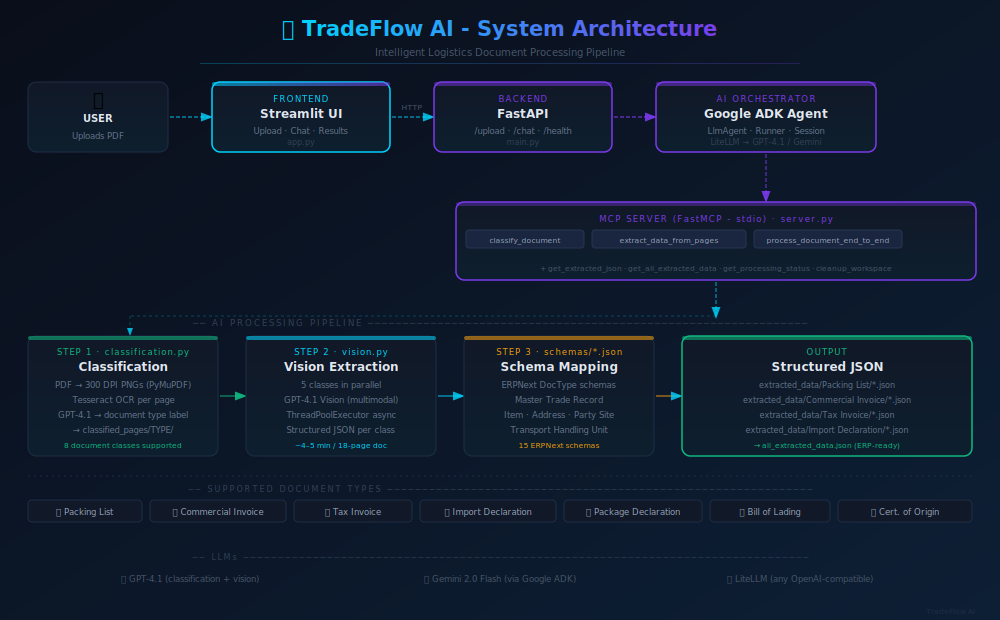

<div align="center">


<br/>

# 🚢 TradeFlow AI

### Intelligent Logistics Document Processing Pipeline

[](https://python.org)
[](https://fastapi.tiangolo.com)
[](https://google.github.io/adk-docs/)
[](https://github.com/jlowin/fastmcp)
[](https://openai.com)
[](LICENSE)

**Drop a multi-page logistics PDF. Get perfectly structured ERPNext-ready JSON - automatically.**

[Demo](#-demo) · [Architecture](#-architecture) · [Quick Start](#-quick-start) · [How It Works](#-how-it-works) · [API Reference](#-api-reference)

</div>

---

## ✨ What Is This?

TradeFlow AI is an **agentic AI pipeline** that ingests complex, multi-page logistics PDF packages and outputs clean, structured JSON data mapped to ERPNext schemas - fully automatically.

A single 18-page document might contain Tax Invoices, a Certificate of Origin, Packing Lists, Bills of Lading, and Import Declarations - all jumbled together. TradeFlow AI:

1. **Classifies** every page using OCR + LLM reasoning
2. **Extracts** structured data from each document class using GPT-4.1 Vision (in parallel)
3. **Maps** extracted fields to ERPNext-compatible JSON schemas
4. **Returns** ERP-ready records - ready for direct import

Built on **Google Agent Development Kit (ADK)**, **Model Context Protocol (MCP)**, **FastAPI**, and **Streamlit**.

---
<!-- 
## 📸 Screenshots

> **📌 Replace these placeholders with actual screenshots before publishing.**

### Main Interface - Document Upload & Processing

```
📷 SCREENSHOT PLACEHOLDER
File: assets/screenshots/01-main-upload.png
How to capture:
  1. Run the app (see Quick Start)
  2. Open http://localhost:8501
  3. Capture the full browser window (1280×900 recommended)
  4. Show the upload zone + sidebar with backend status green
```


---

### Live Processing Log

```
📷 SCREENSHOT PLACEHOLDER
File: assets/screenshots/02-processing-log.png
How to capture:
  1. Upload InfrabuildTest invoice-3.pdf (included in data/)
  2. Click "Process Document"
  3. Screenshot mid-processing showing the step-by-step log
  4. Aim to capture: ✅ page classification lines + extraction progress
```


---

### Extracted JSON Results

```
📷 SCREENSHOT PLACEHOLDER
File: assets/screenshots/03-json-results.png
How to capture:
  1. After processing completes, type "Show all extracted data"
  2. Screenshot the response panel showing structured JSON keys
```


---

### 🎬 Demo Video

```
🎥 SCREEN RECORDING PLACEHOLDER
File: assets/demo/tradeflow-demo.mp4  (or upload to YouTube/Loom)
What to record (suggested ~90 seconds):
  1. [0:00] Open app - show clean UI, green "backend connected"
  2. [0:10] Drag & drop PDF onto upload zone
  3. [0:15] Click "Process Document" - show loading state
  4. [0:25] Fast-forward through processing (x2 speed) showing live log lines
  5. [1:00] Final results: structured JSON output per document class
  6. [1:15] Click "View All Results" quick action - show summary
Tools: OBS Studio (free), Loom (free tier), or macOS Cmd+Shift+5
```

[](https://youtube.com/your-demo-link)

--- -->

## 🏗️ Architecture

<div align="center">

</div>

### System Components

```
TradeFlow AI
├── 🖥️  Streamlit Frontend         - Upload UI, chat interface, results dashboard
├── ⚡  FastAPI Backend             - /upload, /chat, /health endpoints
├── 🤖  Google ADK Agent            - LlmAgent orchestrating the full pipeline
│        └── LiteLLM (GPT-4.1)      - Underlying LLM for agent reasoning
├── 🔌  MCP Server (FastMCP/stdio)  - 7 tools exposed to the ADK agent
│        ├── classify_document
│        ├── extract_data_from_classified_pages
│        ├── process_document_end_to_end
│        ├── get_extracted_json
│        ├── get_all_extracted_data
│        ├── get_processing_status
│        └── cleanup_workspace
└── 📊  AI Pipeline
         ├── classification.py      - OCR (Tesseract) + GPT-4.1 page classifier
         ├── vision.py              - GPT-4.1 Vision parallel extractor
         └── schemas/*.json         - ERPNext DocType schemas
```

### Processing Flow

```
PDF Upload
    │
    ▼
[MCP: classify_document]
    ├── PyMuPDF → 300 DPI PNGs (per page)
    ├── Tesseract OCR → raw text
    └── GPT-4.1 LLM → document type label
           │
           ▼
    classified_pages/
    ├── Tax Invoice/         (page_001.png ... page_003.png)
    ├── Certificate of Origin/
    ├── Commercial Invoice/
    ├── Packing List/
    ├── Bill of Lading/
    ├── Import Declaration/
    └── Package Declaration/
           │
           ▼
[MCP: extract_data_from_classified_pages]
    └── ThreadPoolExecutor (5 classes in parallel)
            └── GPT-4.1 Vision → structured JSON
                    mapped to ERPNext schemas
                           │
                           ▼
                    extracted_data/
                    ├── Packing List/packing_list_batch_result_gpt-4.1.json
                    ├── Commercial Invoice/commercial_invoice_batch_result_gpt-4.1.json
                    ├── Tax Invoice/tax_invoice_batch_result_gpt-4.1.json
                    ├── Import Declaration/import_declaration_batch_result_gpt-4.1.json
                    └── all_extracted_data.json  ← consolidated output
```

---

## 🚀 Quick Start

### Prerequisites

- Python 3.10+
- Tesseract OCR installed (`brew install tesseract` / `apt install tesseract-ocr`)
- Poppler (for PDF→image) - `brew install poppler` / `apt install poppler-utils`
- OpenAI API key (GPT-4.1)
- Google API key (for Gemini/ADK - optional if using GPT-4.1 only)

### 1. Clone

```bash
git clone https://github.com/hiborn4/TradeFlow-Ai.git
cd tradeflow-ai
```

### 2. Install Dependencies

```bash
cd logictic_ai_system/app
pip install -r requirements.txt
```

### 3. Configure Environment

```bash
cp .env.example .env
# Edit .env and add your API keys:
#   OPENAI_API_KEY=sk-...
#   GOOGLE_API_KEY=...  (optional)
```

### 4. Start the Backend

```bash
# From logictic_ai_system/app/
uvicorn main:app --host 0.0.0.0 --port 8001 --reload
```

### 5. Start the Frontend

```bash
# In a new terminal, from logictic_ai_system/app/
streamlit run app.py --server.port 8501
```

### 6. Open the App

```
http://localhost:8501
```

Upload a logistics PDF and watch the pipeline run live! A sample document is provided at:
```
logictic_ai_system/data/InfrabuildTest invoice-3.pdf
```

---

## 🔧 How It Works

### Step 1 - Page Classification (`classification.py`)

Each PDF page is:
1. Converted to a high-resolution PNG (300 DPI) via `pdf2image`
2. Pre-processed to grayscale (improves OCR accuracy)
3. Run through **Tesseract OCR** to extract raw text
4. Classified by **GPT-4.1** into one of 8 document types with a natural language reasoning

Supported classes: `Packing List` · `Commercial Invoice` · `Tax Invoice` · `Import Declaration` · `Package Declaration` · `Bill of Lading` · `Certificate of Origin` · `Unclassified`

### Step 2 - Parallel Vision Extraction (`vision.py`)

5 document classes are processed **simultaneously** using Python's `ThreadPoolExecutor`:

- Images for each class are batched and sent to **GPT-4.1 Vision**
- Each class uses a tailored extraction prompt (in `utils/class_prompts.py`)
- Output is mapped to the corresponding **ERPNext JSON schema**
- Results are saved per-class and consolidated into `all_extracted_data.json`

### Step 3 - ERPNext Schema Mapping (`schemas/*.json`)

Extracted fields are mapped to ERPNext DocTypes:

| Schema | DocType |
|--------|---------|
| `Master Trade Record.json` | Master trade shipment record |
| `Item.json` | Line items / products |
| `Address.json` | Shipper / consignee addresses |
| `Party Site.json` | Party location details |
| `Transport Handling Unit.json` | Container / THU info |
| `Trade Declaration.json` | Customs declaration |
| `Purchase Invoice.json` | Tax/commercial invoice mapping |

### MCP Tools

The **FastMCP server** (`server.py`) exposes 7 tools to the ADK agent via `stdio`:

| Tool | Description |
|------|-------------|
| `classify_document(pdf_path)` | Classify all pages, save to `classified_pages/` |
| `extract_data_from_classified_pages()` | Run parallel vision extraction |
| `process_document_end_to_end(pdf_path)` | Full pipeline in one call |
| `get_extracted_json(document_class)` | Retrieve JSON for a specific class |
| `get_all_extracted_data()` | Return all extracted data |
| `get_processing_status()` | Check current pipeline state |
| `cleanup_workspace()` | Clear all generated files |

---

## 📡 API Reference

### `POST /upload`
Upload a PDF file.

```bash
curl -X POST http://localhost:8001/upload \
  -F "file=@/path/to/document.pdf"
```

**Response:**
```json
{
  "success": true,
  "filename": "document.pdf",
  "file_path": "/absolute/path/to/uploads/document.pdf",
  "message": "File uploaded successfully."
}
```

### `POST /chat`
Send a message to the ADK agent.

```bash
curl -X POST http://localhost:8001/chat \
  -H "Content-Type: application/json" \
  -d '{"message": "Process this document: /path/to/doc.pdf", "session_id": null}'
```

**Response:**
```json
{
  "response": "📄 Processing document...\n\n🔍 Step 1: ...",
  "session_id": "uuid-string",
  "metadata": { "model": "gpt-4.1", "response_length": 842 }
}
```

### `GET /health`
Check backend status.

```bash
curl http://localhost:8001/health
```

---

## 📁 Project Structure

```
tradeflow-ai/
├── 📄 README.md
├── 🚫 .gitignore
│
├── logictic_ai_system/
│   ├── app/
│   │   ├── main.py               # FastAPI + Google ADK agent entrypoint
│   │   ├── server.py             # MCP server (7 tools)
│   │   ├── app.py                # Streamlit frontend
│   │   ├── classification.py     # OCR + LLM page classifier
│   │   ├── vision.py             # GPT-4.1 Vision parallel extractor
│   │   ├── agent_flow.md         # ADK agent system prompt / workflow
│   │   ├── requirements.txt      # Python dependencies
│   │   ├── .env.example          # Environment template
│   │   ├── utils/
│   │   │   ├── class_prompts.py      # Per-class extraction prompts
│   │   │   ├── class_schema_mappings.py  # Class → schema mapping
│   │   │   └── model.py              # Model utilities
│   │   ├── accurate_data/        # Ground truth JSON (for evaluation)
│   │   ├── uploads/              # (runtime) Uploaded PDFs
│   │   ├── classified_pages/     # (runtime) Page PNGs by class
│   │   └── extracted_data/       # (runtime) Output JSONs
│   │
│   └── schemas/
│       ├── Master Trade Record.json
│       ├── Item.json
│       ├── Address.json
│       ├── Party Site.json
│       ├── Transport Handling Unit.json
│       ├── Trade Declaration.json
│       ├── Purchase Invoice.json
│       └── ...
│
└── assets/
    ├── architecture.svg          # System architecture diagram
    └── screenshots/              # UI screenshots for README
```

---

## 🛠️ Tech Stack

| Layer | Technology |
|-------|-----------|
| **Frontend** | Streamlit |
| **Backend API** | FastAPI + Uvicorn |
| **AI Orchestration** | Google Agent Development Kit (ADK) |
| **LLM** | GPT-4.1 (via LiteLLM), Gemini 2.0 Flash |
| **Tool Protocol** | Model Context Protocol (FastMCP, stdio) |
| **OCR** | Tesseract (pytesseract) |
| **PDF Processing** | PyMuPDF (fitz), pdf2image, Poppler |
| **Vision** | OpenAI GPT-4.1 Vision (multimodal) |
| **Concurrency** | Python ThreadPoolExecutor |
| **Schemas** | ERPNext/Frappe DocType JSON |

---

## 🌐 Deployment

### Option A - Local (Recommended for dev/demo)
Follow the [Quick Start](#-quick-start) guide above.

### Option B - Railway (Free tier available)
Railway supports Python + multiple services. See [Railway Docs](https://docs.railway.app).

> ⚠️ **Note:** OCR (Tesseract) and Poppler require system packages. Ensure your deployment environment supports `apt install tesseract-ocr poppler-utils`.

### Option C - Docker (Coming Soon)
```bash
# docker-compose.yml coming in next release
docker-compose up
```

---

## 🗺️ Roadmap

- [ ] Docker + docker-compose for one-command setup
- [ ] Support for image-only PDFs (scanned documents, no text layer)
- [ ] Direct ERPNext API push (auto-create records)
- [ ] Multi-document batch processing
- [ ] Confidence scores per extracted field
- [ ] Support additional document types (AWB, Phytosanitary Certificate)

---

## 🤝 Contributing

Contributions are welcome! Please:

1. Fork the repo
2. Create a feature branch (`git checkout -b feature/amazing-feature`)
3. Commit your changes
4. Open a Pull Request

---

## 📄 License

MIT License - see [LICENSE](LICENSE) for details.

---

<div align="center">

Built with ❤️ using Google ADK · MCP · GPT-4.1 Vision · FastAPI · Streamlit

*If this project helped you, please ⭐ the repo!*

</div>
